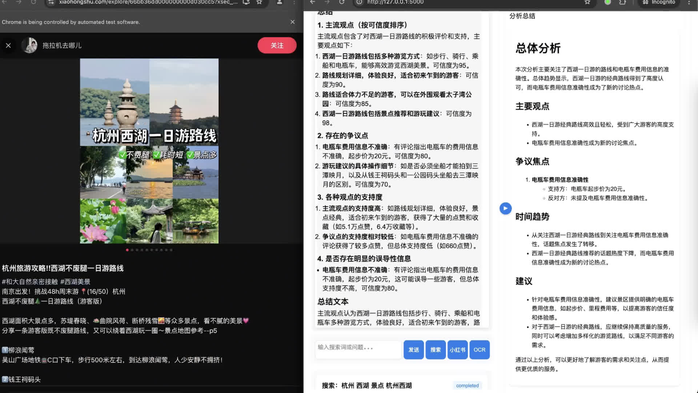

# 小红书智能搜索助手

## 项目简介
基于多模态大模型的智能搜索助手，通过AI技术实现小红书平台的智能化信息检索和知识整合。本项目将AI的认知能力与自动化搜索相结合，为用户提供深度、精准的内容分析和信息提炼服务。

[视频演示 bilibili](https://www.bilibili.com/video/BV1xYD8Y8EAs/)



## 申明
本项目仅作为学习和研究目的，旨在探索AI驱动的信息检索技术与小红书平台的结合应用。项目聚焦于AI技术在信息搜索、理解和整合方面的创新实践。严禁用于商业用途、恶意爬虫或任何可能违反小红书平台服务条款的行为。使用本项目请遵守相关法律法规和平台规则。

## 需求说明

### 1. 核心功能
- 基于多模态大模型的小红书自动搜索工具
- 支持文字或语音输入主题
- 使用AI自动生成搜索关键词
- 自动遍历小红书文章、评论、图片和视频
- 对内容进行识别、归类和总结
- 支持多轮用户交互，根据反馈优化搜索结果

### 2. 使用场景
- 旅游攻略搜索和整理
- 育儿用药等参考信息搜索
- 其他需要深度搜索和信息整理的场景

### 3. 界面需求
#### 3.1 布局设计
- 左侧：用户与AI的对话历史和输入区
- 右侧：搜索结果和数据可视化展示区

#### 3.2 交互要求
- 支持文字输入和语音输入
- 允许用户直接操作浏览器区域（如登录操作）
- 可以查看原始小红书链接和内容
- 支持实时查看自动化操作过程

### 4. 自动化需求
#### 4.1 登录功能
- 首次使用需要登录小红书
- 支持展示登录二维码
- 支持用户手机扫码登录

#### 4.2 搜索功能
- AI自动生成多个相关搜索关键词
- 自动执行搜索操作
- 遍历搜索结果页面
- 收集文章、评论、图片和视频内容

#### 4.3 内容处理
- 直接识别文本内容
- 支持图片内容识别
- 支持视频内容理解
- 对收集的信息进行分类整理
- 生成结构化的搜索报告

### 5. 技术要求
- 使用Python作为主要开发语言
- 采用Selenium进行浏览器自动化
- 使用FastAPI构建Web界面
- 支持实时更新的浏览器操作展示
- 确保浏览器可以被用户直接操作
- 支持记录和恢复浏览历史

### 6. 性能要求
- 界面响应流畅
- 自动化操作可视
- 支持长时间运行
- 内存占用合理

### 7. 扩展需求
- 支持导出搜索结果
- 支持保存搜索历史
- 支持自定义搜索参数
- 支持多用户配置

## 技术栈
- 开发语言：Python
- Web框架：FastAPI
- 浏览器自动化：Selenium + Remote WebDriver
- 前端交互：WebSocket
- AI模型：
  - OpenAI
  - Qwen2-VL-7B Qwen2.5-14B

## 项目结构
[待补充]

## 安装说明
```bash
pip install -r requirements.txt
```

## 使用说明
```bash
python app.py
```

## 许可证
AGPLv3
